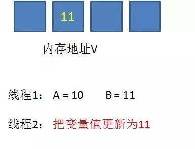

# 公用的实体和工具模块

* 目前提供的实体
  * entity

# Java中两种锁的概念
* 悲观锁
  * Java中的悲观锁，最典型的就是synchronized。而AQS框架下的锁，先尝试使用CAS乐观锁去获取锁，获取不到才会转为悲观锁，如ReentrantLock。悲观锁，顾名思义就是很悲观，认为每次拿去的数据都会被修改，所以在每次拿锁的时候都会上锁，这样别人想拿到这个数据就会block到直到他拿到锁。传统的数据库就使用了很多的这种的机制：如行锁、表锁、读锁、写锁等，都是在做操作之前上锁。共享锁、排他锁、独占锁是悲观锁的一种实现。
* 乐观锁
  * 乐观锁，顾名思义就是很乐观，每次拿去的数据都认为不会被修改，所以不会上锁。但是在更新的时候会判断一下在此期间别人有没有去更新这个数据，对于此过程出现的ABA问题，可以使用版本号进行控制。Java中CAS操作的就是乐观锁，每次不加锁而是假设没有冲突而去完成某项操作，如果因为冲突失败就重试，直到成功为止。

# 多线程操作时的并发问题
下面的代码开两个线程去执行对同一个资源的count的自增。但由于++操作本质是先加后赋值。这个不是原子性的，最终的结果将小于200。
```java
public class Test{
  private static int count = 0;

  public static void main(String[] args) {
    for (int i = 0; i < 2; i++) {
      new Thread(()->{
        try {
          Thread.sleep(10);
        } catch (Exception e) {
          e.printStackTrace();
        }
        //每个线程让count自增100次
        for (int i = 0; i < 100; i++) {
          count++;
        }
      }).start();
    }

    try{
      Thread.sleep(2000);
    }catch (Exception e){
      e.printStackTrace();
    }
    System.out.println(count);
  }
}
```

# Java中处理并发的其中一种操作

给加上互斥锁，保证操作原子性，但性能开销较大

```java
public class Test{
  private static int count = 0;

  public static void main(String[] args) {
    for (int i = 0; i < 2; i++) {
      new Thread(()->{
        try {
          Thread.sleep(10);
        } catch (Exception e) {
          e.printStackTrace();
        }
        //每个线程让count自增100次
        for (int i = 0; i < 100; i++) {
          synchronized (Test.class){
            count++;
          }
        }
      }).start();
    }

    try{
      Thread.sleep(2000);
    }catch (Exception e){
      e.printStackTrace();
    }
    System.out.println(count);
  }
}
```

为了处理synchronized关键字造成的性能问题，Jdk1.6为Synchronized做了优化，增加了从偏向锁到轻量级锁再到重量级锁的过度，但是在最终转变为重量级锁之后，性能仍然较低。

# Jdk1.6JVM中锁的状态优化


> 无锁状态（Unlocked）

当对象没有被任何线程锁定时处于无锁状态。

> 有锁状态（Owned）

当一个线程获得了对象的锁时，该对象处于被该线程拥有的状态。

> 可偏向锁状态（Biased）

概念：偏向锁会偏向于第一个访问锁的线程，如果在接下来的运行过程中，该锁没有被其他的线程访问，则持有偏向锁的线程将永远不需要触发同步。也就是说，偏向锁在资源无竞争的情况下消除了同步语句，连CAS操作都不做了，提高了程序的运行性能

引入偏向锁是为了在无多线程竞争的情况下尽量减少不必要的轻量锁执行路径。因为轻量级锁的获取以及释放依赖多次CAS原子指令，而偏向锁只需要在置换ThreadID的时候依赖一次原子指令（由于一旦出现多线程竞争的情况就必须撤销偏向锁，所以偏向锁的撤销操作的性能损耗必须小于节省下来的CAS原子指令的性能消耗）上面说过，轻量级锁是为了在多线程交替执行同步块时提高性能，而偏向锁则是在只有一个线程执行同步块的时候进一步提高性能。

> 轻量级锁状态（Lightweight）

“轻量级”是相对于使用操作系统互斥量来实现传统锁而言的。但是首先需要强调一点的是，轻量级锁并不是用来代替重量级锁的，它的本意是在没有多线程竞争的前提下，减少传统的重量级锁使用产生的性能消耗。当多个线程对同一个对象进行锁定竞争时，对象会从可偏向锁升级为轻量级锁。轻量级锁使用CAS（Compare and Swap）操作来实现锁的获取和释放，避免了传统的重量级锁的互斥操作，提高了性能。

在解释轻量级锁的执行过程过程之前，我们要先明白一点，轻量级锁使用的场景是线程交替同步块的情况，如果存在同一时间访问同一锁的情况，就会导致轻量级锁膨胀为重量级。

> 重量级锁状态（Heavyweight）

synchronized是通过对象内部的一个监视器锁（monitor）实现的。但是monitor底层又依赖于底层操作系统的Mutex Lock实现的。Synchronized虽然确保了线程的安全，但是在性能上却不是最优的，Synchronized关键字会让没有得到锁资源的线程进入BLOCKED状态，而后在争夺到锁资源后恢复为RUNNABLE状态，这个过程中涉及到操作系统实现线程之间的切换就需要从用户态切换到核心态，切换的成本很高，状态之间的转化需要相对比较长的时间，这就是synchronized效率低的原因，因此，这种依赖于操作系统的Mutex Lock所实现的锁被称之为“重量级锁”。重量级锁使用操作系统的互斥量来实现锁的获取和释放，保证了线程的互斥访问。

# 使用原子操作类
所谓原子操作类，指的是java.util.concurrent.atomic包下，一系列以Atomic开头的包装类。例如AtomicBoolean，AtomicInteger，AtomicLong。它们分别用于Boolean，Integer，Long类型的原子性操作。

```java
public class Test{
  private static AtomicInteger count = new AtomicInteger(0);

  public static void main(String[] args) {
    for (int i = 0; i < 2; i++) {
      new Thread(()->{
        try {
          Thread.sleep(10);
        } catch (Exception e) {
          e.printStackTrace();
        }
        //每个线程让count自增100次
        for (int i = 0; i < 100; i++) {
          count.incrementAndGet();
        }
      }).start();
    }

    try{
      Thread.sleep(2000);
    }catch (Exception e){
      e.printStackTrace();
    }
    System.out.println(count.get());
  }
}
```

Atomic操作的底层实现正是利用的CAS机制。

# CAS机制
CAS是英文单词Compare And Swap的缩写，翻译过来就是比较并替换。

CAS机制当中使用了3个基本操作数：内存地址V，旧的预期值A，要修改的新值B。

更新一个变量的时候，只有当变量的预期值A和内存地址V当中的实际值相同时，才会将内存地址V对应的值修改为B。

* 初始内存中有一个地址存储变量10
  * 
* 线程1打算将变量更改为11
  * 
* 此时线程2介入，先完成了更新
  * 
* 线程1执行更新，比较失败，不更新
  * 
* 线程1自旋，重写读取内存内容，重写计算要更新的新值11->12
  * 
* 线程1执行更新，比较成功，成功更新
* 
* 


# Java中实现的几种锁
* 阻塞锁
  * [BlockedLockTest.java](src/test/java/com/zhuzhe/common/BlockedLockTest.java)
  * 获取锁时会导致线程阻塞（挂起），直到锁可用或者等待超时。
* 非阻塞锁
  * [NonBlockingLockTest.java](src/test/java/com/zhuzhe/common/NonBlockingLockTest.java)
  * 当一个线程尝试获取非阻塞锁时，如果锁已被其他线程占用，该线程不会被挂起，而是立即返回，可以继续执行其他任务或处理其他逻辑。
* 可重入锁
  * [ReentrantLockTest.java](src/test/java/com/zhuzhe/common/ReentrantLockTest.java)
  * 在传统的互斥锁中，当一个线程获得锁后，在释放锁之前，其他线程无法获取该锁。而可重入锁允许线程在持有锁的情况下再次获取该锁，而不会发生死锁。可重入锁的设计目的是为了简化对临界区的访问控制。当线程第一次获得可重入锁时，计数器加1，并持有锁。此后，每次线程重复获取可重入锁时，计数器都会递增；每次释放可重入锁时，计数器递减。只有当计数器变为0时，锁才算完全释放。
* 自旋锁
  * [SpinLockTest.java](src/test/java/com/zhuzhe/common/SpinLockTest.java)
  * 一种基于忙等待的锁机制。在传统的互斥锁中，当线程无法获取锁时会被挂起，等待锁的释放。而自旋锁不会将线程挂起，而是使用循环不断地尝试获取锁，直到获取成功。适用于临界区的代码执行时间非常短，线程挂起和恢复的开销比自旋等待的开销更大。线程在等待锁的时间很短，预计很快可以获取到锁。
* 读写锁
  * [ReadWriteLockTest.java](src/test/java/com/zhuzhe/common/ReadWriteLockTest.java)
  * 一种并发控制机制，用于在多线程环境下对共享资源进行访问控制。它允许多个线程同时对共享资源进行读操作，但只允许一个线程进行写操作。
* 公平锁与非公平锁
  * ReentrantLock同时支持公平锁和非公平锁。
  * 公平锁： 指多个线程按照申请锁的顺序来获取锁，线程直接进入队列中排队，队列中的第一个线程才能获得锁。
  * 在创建ReentrantLock时传递参数true
  * 非公平锁： 多个线程加锁时直接尝试获取锁，能抢到锁到直接占有锁，抢不到才会到等待队列的队尾等待。
  * 在创建ReentrantLock时不传递或传递false参数
  * [UnfairLockTest.java](src/test/java/com/zhuzhe/common/UnfairLockTest.java)
* 显示锁与内置锁
  * 显示锁，是人为手动的锁，如：ReentrantLock、Lock锁，也就是说，实现了Lock的锁都是显示锁
  * 内置锁：内置锁使用synchronized，内置锁是互斥锁。Java中每个对象都可以用作一个实现同步的锁。 线程进入同步代码块或方法的时候会自动获得该锁，在退出同步代码块或方法时会释放该锁。获得内置锁的唯一途径就是进入这个锁的保护的同步代码块或方法。
* 轮询锁和定时锁
  * ReentrantLock所实现的tryLock()方法
  * 轮询锁：boolean tryLock()：仅在调用时锁为空闲状态才获取该锁。如果锁可用，则获取锁，并立即返回值 true。如果锁不可用，则此方法将立即返回值 false。
  * 定时锁：boolean tryLock(long time, TimeUnit unit) throws InterruptedException：
　　如果锁在给定的等待时间内空闲，并且当前线程未被中断，则获取锁。
　　如果锁可用，则此方法将立即返回值 true。如果锁不可用，出于线程调度目的，将禁用当前线程，并且在发生以下三种情况之一前，该线程将一直处于休眠状态：
　　锁由当前线程获得；或者
　　其他某个线程中断当前线程，并且支持对锁获取的中断；或者
　　已超过指定的等待时间
　　如果获得了锁，则返回值 true。
　　如果当前线程：
　　在进入此方法时已经设置了该线程的中断状态；或者
　　在获取锁时被中断，并且支持对锁获取的中断，
　　则将抛出 InterruptedException，并会清除当前线程的已中断状态。
　　如果超过了指定的等待时间，则将返回值 false。如果 time小于等于 0，该方法将完全不等待。
* 对象锁和类锁
  * 关键字在实例方法上，锁为当前实例。
    关键字在静态方法上，锁为当前Class对象。
    关键字在代码块上，锁为括号里面的对象。
    1. 对象锁和类锁在基本概念上和内置锁是一致的，但是，两个锁是有很大的区别，对象锁适用于对象的实例方法，或者一个对象实例上的，类锁是作用于类的静态方法或者一个类的class对象上的。
    2. 类的实例可以有多个，但是每个类只有一个class对象，不同实例的对象锁是互不相干的，但是每个类只有一个类锁。
    3. 其实类锁只是一个概念上的东西，并不是真实存在的，它只是用来帮我们理解锁定实例方法和静态方法的区别。
    4. synchronized只是一个内置的加锁机制，当某个方法加上synchronized关键字的后，就表明要获得该内置锁才能执行，并不能阻止其他线程访问不需要获得该锁的方法。
    5. 调用对象的wait()方法的时候，会释放持有的对象锁，以便于调用 notify() 方法使用。notify()调用之后，会等到notify()所在的线程执行完毕之后再释放锁。
* 锁粗化
  * 就是将多次连接在一起的加锁、解锁操作合并为一次，将多个连续的锁拓展为一个更大的锁。降低重复申请锁的资源消耗。
* 锁消除
  * JVM的代码优化，锁消除即：删除不必要的加锁操作。根据代码逃逸技术，如果判断到一段代码中，堆上的数据不会逃逸出当前线程。那么可以认定这段代码是线程安全的，不必要加锁。
* 信号量
  * 用于控制并发访问的同步工具。它维护了一定数量的许可证（permits），线程在执行任务之前需要先获取许可证，执行完任务后释放许可证，其他线程才能获取到许可证执行任务。
  * 信号量可以用来限制同时访问某个资源或代码段的线程数量。它可以防止过多的线程同时访问某个共享资源，从而有效控制并发访问造成的问题，如资源竞争、死锁等。
    * 计数信号量（Counting Semaphore）：这种类型的信号量维护一个计数器，表示当前可用的许可证数量。
    * 二进制信号量（Binary Semaphore）：这种类型的信号量实际上是计数信号量的特殊情况，计数器只能为0或1，也就是只有一个许可证。它可以用作互斥锁（Mutex）的替代，用于控制对某个共享资源或代码段的互斥访问。
  * 通过创建一个信号量对象，并在需要控制并发访问的地方使用acquire()和release()方法，可以很方便地实现线程间的同步与互斥操作。
* 独享锁：锁A只能被一个锁拥有，如synchronized。ReentrantLock是独享锁，他是基于AQS实现的，在ReentrantLock源码中， 使用一个int类型的成员变量state来表示同步状态，当state>0时表示已经获取了锁 。 而当c等于0的时候说明当前没有线程占有锁。
* 共享锁：共享锁，也就允许多个线程同时获取，所以同步状态的数量同时的大于1的，如果同步状态为非0，则线程就可以获取锁，只有当同步状态为0时，才说明共享数量的锁已经被全部获取，其余线程只能等待。ReentrantReadWriteLock里的读锁，它的读锁是可以被共享的，但是它的写锁确每次只能被独占。
* 分段锁：HashMap的底层是数组+链表。同样的，ConcurrentHashMap的底层树结构是数组+链表，但是和HashMap不一样的是，ConcurrentHashMap的中存放数据是一段一段的。即由很多个Segment(段)组成的，每个Segment中都有着类似于数组+链表的结构
* 死锁：
  ```java
  public class DeadLockDemo {
    public static void main(String[] args) {
        String lockA = "lockA";
        String lockB = "lockB";
        MyThread myThread1 = new MyThread(lockA,lockB);
        MyThread myThread2 = new MyThread(lockB,lockA);
        new Thread(myThread1).start();
        new Thread(myThread2).start();
    }
  }
  class MyThread implements Runnable {
  
    private String lockA;
    private String lockB;
  
    public MyThread(String lockA, String lockB) {
      this.lockA = lockA;
      this.lockB = lockB;
    }
  
    @Override
    public void run() {
      synchronized (lockA) {
        System.out.println(Thread.currentThread().getName() + "lock：" + lockA + " => " + lockB);
        try {
          TimeUnit.SECONDS.sleep(2);
        } catch (InterruptedException e) {
          e.printStackTrace();
        }
        synchronized (lockB) {
          System.out.println(Thread.currentThread().getName() + "lock：" + lockB + " => " + lockA);
        }
      }
    }
  }
  ```