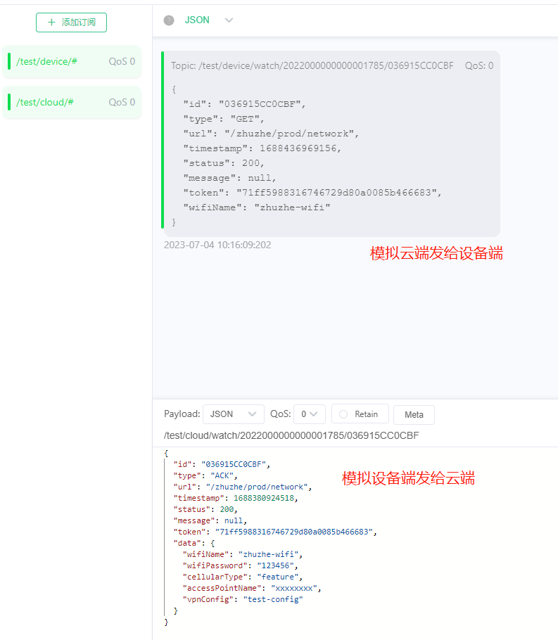

# spring integration mqtt

## 基于spring-integration-mqtt实现的MQTT服务
1. 实现基本的通过代理服务器的云端消息发送和回复, 也实现了对设备端的调用和回复
2. 代码设计上尽量兼容多主题监听和处理


## 使用的MQTT Broker: EMQX

官网： https://www.emqx.io/

安装方式：Docker

```bash
docker run -d --name emqx -p 1883:1883 -p 8083:8083 -p 8084:8084 -p 8883:8883 -p 18083:18083 emqx/emqx
```

暴露端口： 1883（连接使用），18083（web平台使用）

默认账号密码： admin public

### 连接测试

MQTTX官网：https://mqttx.app/zh

连接操作:https://www.emqx.io/docs/zh/v5/getting-started/getting-started.html

启动后测试接口




### 主题订阅

在使用MQTTX连接上代理服务器后，客户端则可以自由向服务器订阅主题和发送消息。
在本项目中是通过配置文件指定了几个主题的订阅（监听）。

```properties
# 应用端口
server.port=5018
# mqtt broker（代理服务器）地址
mqtt.url=tcp://localhost:1883
# 代理服务器账号
mqtt.username=admin
# 代理服务器密码
mqtt.password=public
# 连接客户端（SpringBoot应用）的名称
mqtt.client_id=mqtt-cloud
# 连接超时时间
mqtt.timeout=60
# 心跳检测间隔时间
mqtt.keepalive=20
# 主题定义 /test/device/产品分组/SN/MAC
# 发送主题
mqtt.send_topic=/test/device/{group}/+/+
# 订阅主题
mqtt.handle_topic=/test/cloud/{group}/+/+
# 产品分组（用于拼接主题）
mqtt.group=watch,camera,battery
```

### 实现方式

> 方式一: 请求异步回调

这种模式是比较常见物联网平台使用的。前端展示的设备相关数据，都是通过在一定超时时间内，发送消息后接收回复前端。

使用jdk8提供的函数式编程，定义函数式接口，将回调操作作为参数传递进入，在根据token缓存起来，当设备端回复后，就从缓存中取出并使用线程池去执行回调操作

[WatchService.java](src/main/java/com/zhuzhe/integrationmqtt/service/WatchService.java)

消息处理者

[AsyncCallbackDispatchHandler.java](src/main/java/com/zhuzhe/integrationmqtt/mqtt/handler/AsyncCallbackDispatchHandler.java)


> 方式二: 请求发布订阅

这种模式也就是一开始使用这个spring integration mqtt框架所提供的一种操作模式，只是本项目中借鉴其他人的设计做了一个注解来简化部分发送和订阅操作。

注解类和方法，将在处理者启动时扫描并存入列表缓存中。当发生回调时，从列表中匹配取出并反射执行。

[WatchPublishService.java](src/main/java/com/zhuzhe/integrationmqtt/service/pubsub/WatchPublishService.java)

[WatchSubscribeService.java](src/main/java/com/zhuzhe/integrationmqtt/service/pubsub/WatchSubscribeService.java)

消息处理者

[PublishSubscribeDispatchHandler.java](src/main/java/com/zhuzhe/integrationmqtt/mqtt/handler/PublishSubscribeDispatchHandler.java)