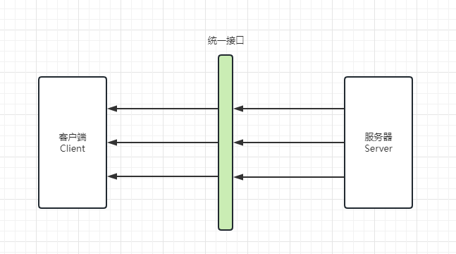
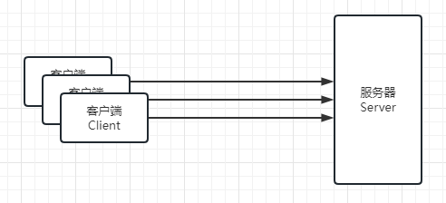
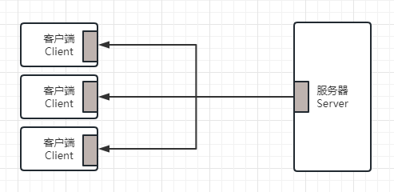
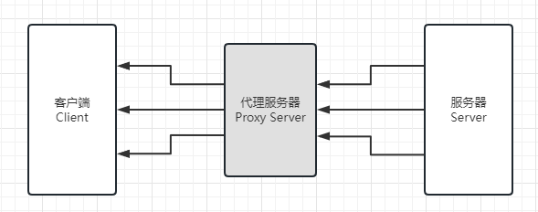
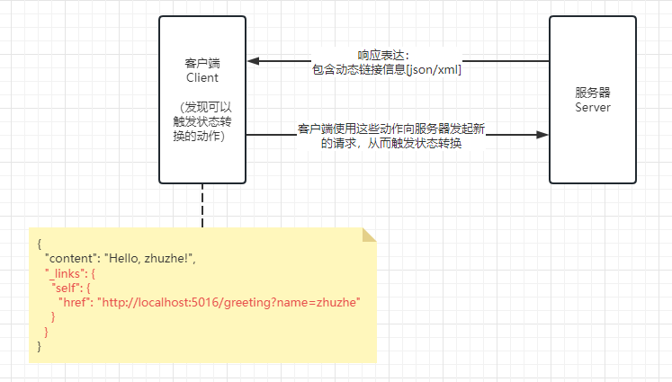
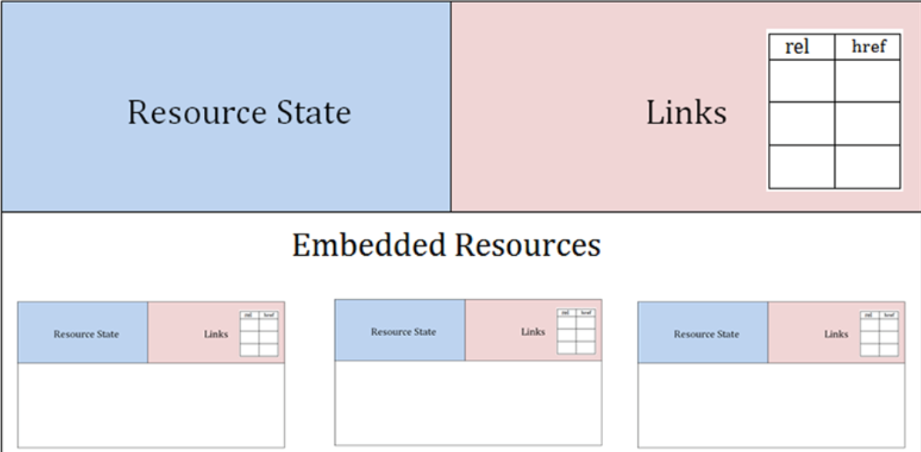

# REST风格——HATEOAS超媒体格式

## HATEOAS 概念

> HATEOAS (Hypermedia as the Engine of Application State) 被称为超媒体驱动是因为它的设计思想主张使用超媒体来驱动应用程序的状态转换。在 HATEOAS 中，每个资源都包含了可以让客户端进行状态转换所需的所有信息，包括可执行的操作和相关参数等。这些信息以超媒体格式（例如 HTML 或 JSON）呈现，因此客户端能够使用这些超媒体链接自动地发现和执行状态转换。

## REST 架构

### REST 风格
REST架构风格成为当今构建Web服务时，应该遵循的事实标准。

### REST 定义
> REST (representational stat transfer) 表达性状态转换

只有满足这些约束，才能称为符合REST架构风格
1. REST是一种架构风格，它包含了一个分布式超文本系统中对于组件、连接器和数据的约束。
2. REST是作为互联网自身架构的抽象而出现的，其关键在于所定义的架构上的各种约束。

### REST 约束
1. 客户端 --- 服务器 结构
    ```
    通过一个统一的接口来分开客户端和服务器，使得两者可以独立开发和演化。客户端的实现可以简化，而服务器可以更容易满足伸缩性的要求。
    ```
   
2. 无状态
    ```
    在不同的客户端请求之间，服务器并不保存客户端相关的上下文状态信息。任何客户端发出的每个请求都包含了服务器处理改请求所需的全部信息。
    ```
   
3. 可缓存
    ```
    客户端可以缓存服务器返回的响应结果，服务器可以定义响应结果的缓存设置。
    ```
   
4. 分层的系统
    ```
    在分层的系统中，可能有中间服务器来处理安全策略和缓存的相关的问题，以提高系统的可伸缩性。而客户端并不需要了解中间这些层次的细节。
    ```
   
5. 按需代码（可选）
    ```
    服务器可以通过传输可执行代码的方式来扩展或自定义客户端的行为，这是一个可选的约束。
    ```
6. 统一接口
   > 该约束是REST服务的基础，是客户端和服务器之间的桥梁，该约束又包含下面4个子约束。
   1. 资源标识符
      > 每个资源都有各自的标识符，客户端在请求时需要指定该标识符。在REST服务中，该标识符通常是URI。
      > 客户端所获取的是资源的表达（representation），通常使用XML或JSON格式。 
   2. 通过资源的表达来操作资源
      > 客户端根据所得到的资源的表达中包含的信息，来了解如何操作资源，比如对资源进行修改或删除。
   3. 自描述的消息
      > 每条消息都包含足够的信息来描述如何处理该消息。
   4. 超媒体作为应用状态的引擎（HATEOAS）
      > 客户端通过服务器提供的超媒体内容中动态提供的动作来进行状态转换。

### 表达性状态转换
> "表达性" 是指对于资源的操作都是通过服务器提供的资源的表达式来进行的。客户端在根据资源的标识符获取到资源的表达之后，从资源的表达中可以发现其可以使用的动作。使用这些动作会发出新的请求，从而触发状态转移。

### HATEOAS 约束
HATEOAS(Hypermedia as the Engine of Application State)超媒体作为应用状态的引擎。是REST风格中最复杂的约束，也是构建成熟REST服务的核心。

它的重要性在于打破了客户端和服务器之间严格的契约，使得客户端可以更加智能和自适应，而REST服务本身的演化和更新也变得更加容易。

**Hypermedia**: 超媒体，标识任何包含指向图片、电影、文字等资源的链接，Web是超媒体的经典例子。

#### REST 成熟度
1. **Level0**: Web服务只使用HTTP作为传输方式，实际上只是远程方法调用（RPC）的一种具体形式。类似SOAP、XML-RPC。
2. **Level1**: Web服务引入的资源的概念，每个资源有对于的标识符和表达来表示不同的结果。
3. **Level2**: Web服务使用不同的HTTP方法来进行不同的操作，并且使用HTTP状态码来表示不同的结果。方法: GET、SET、DELETE，状态码: 200、301、400、404、500。
4. **Level3**: Web服务使用HATEOAS，在资源的表达中包含了链接信息。客户端可以根据链接来发现可执行的动作。
   1. 不使用HATEOAS的REST服务: 客户端和服务器的实现之间是紧密耦合的，客户端需要工具服务器提供的相关文档来了解所暴露的资源和对应的操作。当服务器发生了变化时，如修改了资源的URI，客户端也需要进行相应的修改。
   2. 使用HATEOAS的REST服务: 客户端可通过服务器提供的资源的表达来智能发现可以执行的操作。当服务器发生变化时，客户端并不需要做出修改，因为资源的URI和其他信息都是动态发现的。


#### 使用
Spring Hateoas是一个用于支持实现超文本驱动的REST Web服务的开发库。提供了简单的机制来创建这些链接，并与Spring MVC框架有很好的集成。对已有的Spring MVC应用，只需要一些简单改动就可以满足hateoas约束。

**引入依赖**：
```xml
<dependency>
  <groupId>org.springframework.boot</groupId>
  <artifactId>spring-boot-starter-hateoas</artifactId>
</dependency>
```

**链接关系和链接地址**

通过使用Link类，你可以在资源表述中添加链接关系和链接地址等信息。例如给一个模型添加link信息。
```java
import static org.springframework.hateoas.server.mvc.WebMvcLinkBuilder.*;

public class Test {
  void method(){
     Link link = linkTo(methodOn(HateoasController.class).greeting(name)).withSelfRel();
     xxxModel.add(link);
  }
}
```

**超媒体表述模型**

要想将一个原本存在的实体，添加link信息后成为超媒体模型。则需要使用spring hateoas依赖提供的超类。

* [x] 纯粹的超媒体模型，用于描述一些只包含链接信息或其他与超媒体相关的元数据的资源表述。

`extends EntityModel<TestEntity>`
```java
import org.springframework.hateoas.EntityModel;

public class TestEntity extends EntityModel<TestEntity> {
  private Long id;
  private String content;
  //...
}
```
在成为超媒体表述模型后，就可以add它的link信息了。

```java
import static org.springframework.hateoas.server.mvc.WebMvcLinkBuilder.*;

import org.springframework.web.bind.annotation.RequestMapping;
import org.springframework.web.bind.annotation.RestController;

@RestController
public class TestController {
  //...
   void method(){
      // 添加自描述信息
      student.add(linkTo(methodOn(HateoasController.class).getStudent(id)).withSelfRel());
      // 添加其他描述信息
      student.add(linkTo(methodOn(HateoasController.class).greeting("ccc")).withRel("greeting"));
   }
}
```

**实体资源模型**

也是hateoas作为REST项目实现资源状态转移的所支持的功能，添加link的方式和上面一样。
* [x] 具有实际数据对象的资源表述，它除了包含实际数据对象外，还可以包含一些额外的链接信息和元数据。
```java
import org.springframework.hateoas.RepresentationModel;
public class TestEntity extends RepresentationModel<Greeting>{
  //...
}
```

**集合资源模型**

也是hateoas作为REST项目实现资源状态转移的所支持的功能，添加link的方式和上面一样。
* [x] 集合类型的资源表述，用于表示一组具有相同数据类型和超媒体语义的资源。
```java
public class TestEntity{
  private Long id;
  private String content;
  //...
}
```
```java
import org.springframework.hateoas.CollectionModel;

public class EntityList extends CollectionModel<TestEntity>{
  //...
}
```

**实现效果**：

发送请求: http://localhost:5016/greeting
返回结果:
```
{"content":"Hello, zhuzhe!","_links":{"self":{"href":"http://localhost:5016/greeting?name=zhuzhe"}}}
```



### 超媒体控制与HAL

在添加链接之后，服务器提供的表达可以帮助客户端更好发现服务器端所支持的动作。

在具体的表达中，应用虽然可以根据需要选择最合适的格式，但是在表达的基本结构上应该遵循一定的规范。

这样可以保证最大的适用性，这个基本结构主要是整体的组织方式和链接的格式。

#### JSON Hypermedia Types

JSON媒体类型没有提供原生的超链接语法，所以为了解决这个问题，有几种JSON超媒体类型被创建出来：
1. HAL: http://stateless.co/hal_specification.html
2. JSON-LD: http://json-ld.org
3. Collection-JSON: http://amundsen.com/media-types/collection/
4. JSON-API: http://jsonapi.org/
5. Siren: https://github.com/kevinswiber/siren

其中HAL是最流行，而且被Spring Framework支持。

#### HAL
> HAL(Hypertxt Application Language) 是简单的超媒体类型，一个被广泛采用的超文本表达规范。
> HAL支持XML和JSON格式

应用可以考虑遵循改规范，Spring hateoas提供了对HAL的支持。

HAL媒体类型定义了一种资源，它是状态的容器、links的集合、嵌套资源的集合。



**规范**:
1. 资源的表达中包含链接、嵌套的资源和状态。资源的状态是该资源本身所包含的数据。
2. 链接则包含指向的目标（URI）、所表达的关系和其他可选的相关属性。
   1. 资源的链接包含在_links属性对应的哈希对象中。该_links哈希对象中的键（key）是链接的关系，而值（value）则是另外一个包含了href等其他链接属性的对象或对象数组。
   2. 当前资源中所包含的嵌套资源由_embeded属性来表示，其值是一个包含了其他资源的哈希对象。链接的关系不仅是区分不同链接的标识符，同样也是指向相关文档的URL。文档用来告诉客户端如何对该链接所指向的资源进行操作。当开发人员获得资源的表达之后，可以通过查看链接指向的文档来了解如何操作该资源。
3. 使用URL作为链接关系带来的问题
   > URL作为属性名称来说显得过长，而且不同关系的URL的大部分内容的重复的。为了解决这个问题，可以使用Curie作为链接关系的模板。链接的关系声明时使用Curie的名称作为前缀，不用提供完整的URL。应用中声明的Curie出现在_links属性中。
   
   例子: 代码中定义了URI模板为 http://localhost:5016/todoList/rels/{rel} 名为todo的Curie。
   
   在使用Curie之后，名为items的链接关系，变成了包含前缀的 todo:items 的形式。这就表示该链接的关系实际上是 http://localhost:5016/todoList/rels/items

   ```json
   {
     "id": 1,
     "body": "My first blog post",
     "postdate": "2015-05-30T21:41:12.650Z",
     "links": [
       {
         "rel": "self",
         "href": "http://blog.example.com/posts/1",
         "method": "GET"
       }
     ]
   }
   ```
   * href: 用户可以用来检索资源或者改变应用状态的URI
   * rel: 描述href指向的资源或现有资源的关系
   * method: 和此URI需要的HTTP方法
   * self: 表示自描述的关系

**使用例子**:

* 资源状态是使用json的key-value格式表达
  ```json
  {
    "id" : 1,
    "body" : "My first post",
    "postdate" : "2023-06-21T21:41:12.650Z"
  }
  ```
* HAL规范中定义，使用_links包含所有的link。
  ```json
  {
    "id": 1,
    "body": "My first post",
    "postdate": "2023-06-21T21:41:12.650Z",
    "_links": {
      "self": {
        "href": "http://localhost:5016/greeting?name=zhuzhe"
      },
      "comments": {
        "href": "http://localhost:5016/comments/1"
      },
      "tags": {
        "href": "http://localhost:5016/comments/1/tags"
      }
    }
  }
  ```
* HAL规范使用"_embedded"属性来表示嵌入式（即内嵌）的资源
   ```json
   {
     "id": 1,
     "body": "My first post",
     "postdate": "2023-06-21T21:41:12.650Z",
     "_links": {
       "self": {
         "href": "http://localhost:5016/greeting?name=zhuzhe"
       },
       "comments": {
         "href": "http://localhost:5016/comments/1"
       },
       "tags": {
         "href": "http://localhost:5016/comments/1/tags"
       }
     },
     "_embedded": {
       "items": [
         {
           "_links": {
             "self": {
               "href": "/products/123"
             },
             "product": {
               "href": "/products/123"
             }
           },
           "quantity": 2,
           "price": 5
         },
         {
           "_links": {
             "self": {
               "href": "/products/456"
             },
             "product": {
               "href": "/products/456"
             }
           },
           "quantity": 4,
           "price": 1
         }
       ]
     }
   }
   ```


### 项目中提供的例子
* http://localhost:5016/greeting
   ```json
   {
     "content": "Hello, zhuzhe!",
     "_links": {
       "self": {
         "href": "http://localhost:5016/greeting?name=zhuzhe"
       }
     }
   }
   ```
* http://localhost:5016/student/1
   ```json
   {
     "id": 1,
     "name": "zhuzhe",
     "_links": {
       "self": {
         "href": "http://localhost:5016/student/1"
       },
       "greeting": {
         "href": "http://localhost:5016/greeting?name=ccc"
       }
     }
   }
   ```
* http://localhost:5016/books
   ```json
   {
     "_embedded": {
       "bookList": [
         {
           "id": 1,
           "title": "Java"
         },
         {
           "id": 1,
           "title": "MySQL"
         },
         {
           "id": 1,
           "title": "Html"
         }
       ]
     },
     "_links": {
       "self": {
         "href": "http://localhost:5016"
       }
     }
   }
   ```


