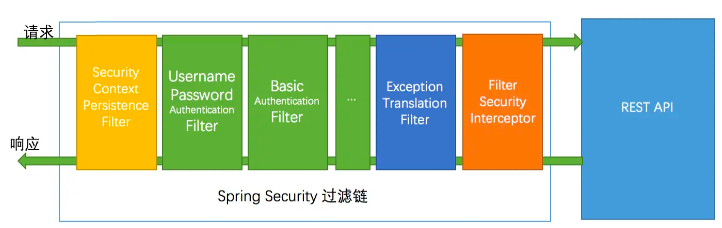

# Spring Security 

### Security+Jwt实现的用户登陆&校验
* 注册接口
    ```
    POST http://localhost:5015/user/register
    
    Content-Type: application/json

    {
        "username": "用户名",
        "password": "密码"
    }
    ```
* 登陆接口
    ```
    POST http://localhost:5015/user/login
    
    Content-Type: multipart/form-data; boundary=----WebKitFormBoundary7MA4YWxkTrZu0gW

    ------WebKitFormBoundary7MA4YWxkTrZu0gW
    Content-Disposition: form-data; name="用户名"

    exampleuser
    ------WebKitFormBoundary7MA4YWxkTrZu0gW
    Content-Disposition: form-data; name="密码"

    examplepassword
    ------WebKitFormBoundary7MA4YWxkTrZu0gW--
    ```
* 免验证接口
    ```
    GET http://localhost:5015/permit
    ```
* 获取当前登陆用户信息
    ```
    GET http://localhost:5015/user
    
    Authorization: Bearer {token}
    ```
* 测试后端校验
    ```
    GET http://localhost:5015/pre-authorize/product
  
    Authorization: Bearer {token}
    ```
* 绑定用户角色
    ```
    POST http://localhost:5015/role/bind
    
    Authorization: Bearer {token}
    Content-Type: application/json

    {
    "userId": 1,
    "roleId": 1
    }
    ```
* 解绑用户角色
    ```
    DELETE http://localhost:5015/role/unbind/{userId}/{roleId} HTTP/1.1
  
    Authorization: Bearer {token}
    ```
* 查看用户列表
    ```
    GET http://localhost:5015/user/list
  
    Authorization: Bearer {token}
    ```
* 登出接口
    ```
    GET http://localhost:5015/user/logout
  
    Authorization: Bearer {token}
    ```
### 介绍

* Security 调用链

  

  

* Jwt 加密与解析

  

* Security + Jwt 的调用流程

  
